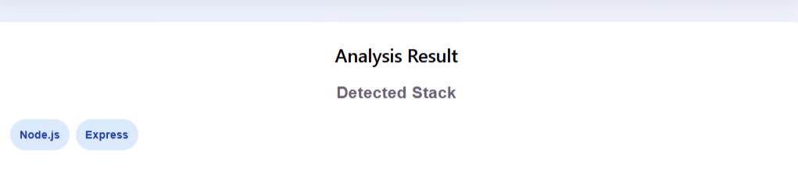
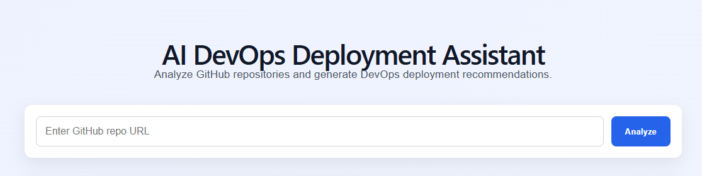
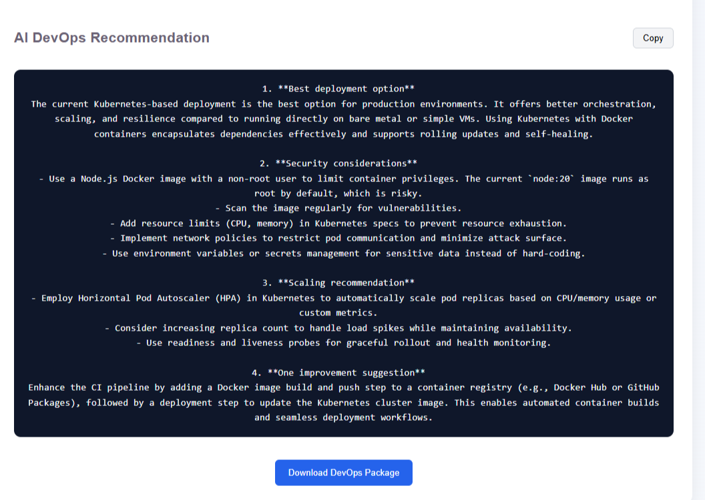
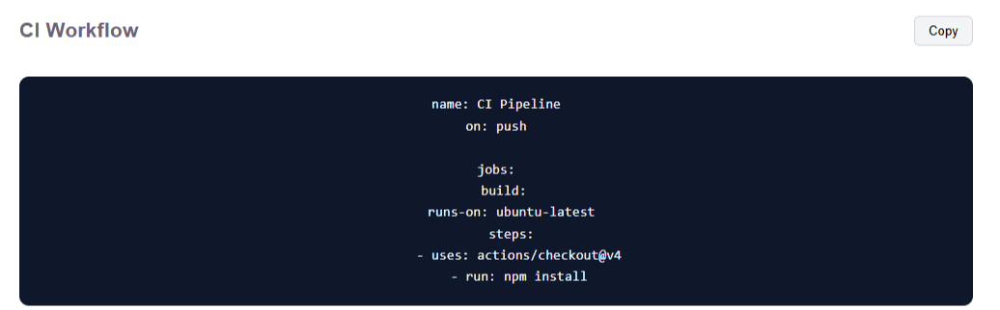
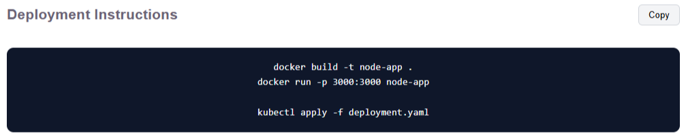
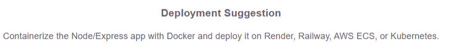
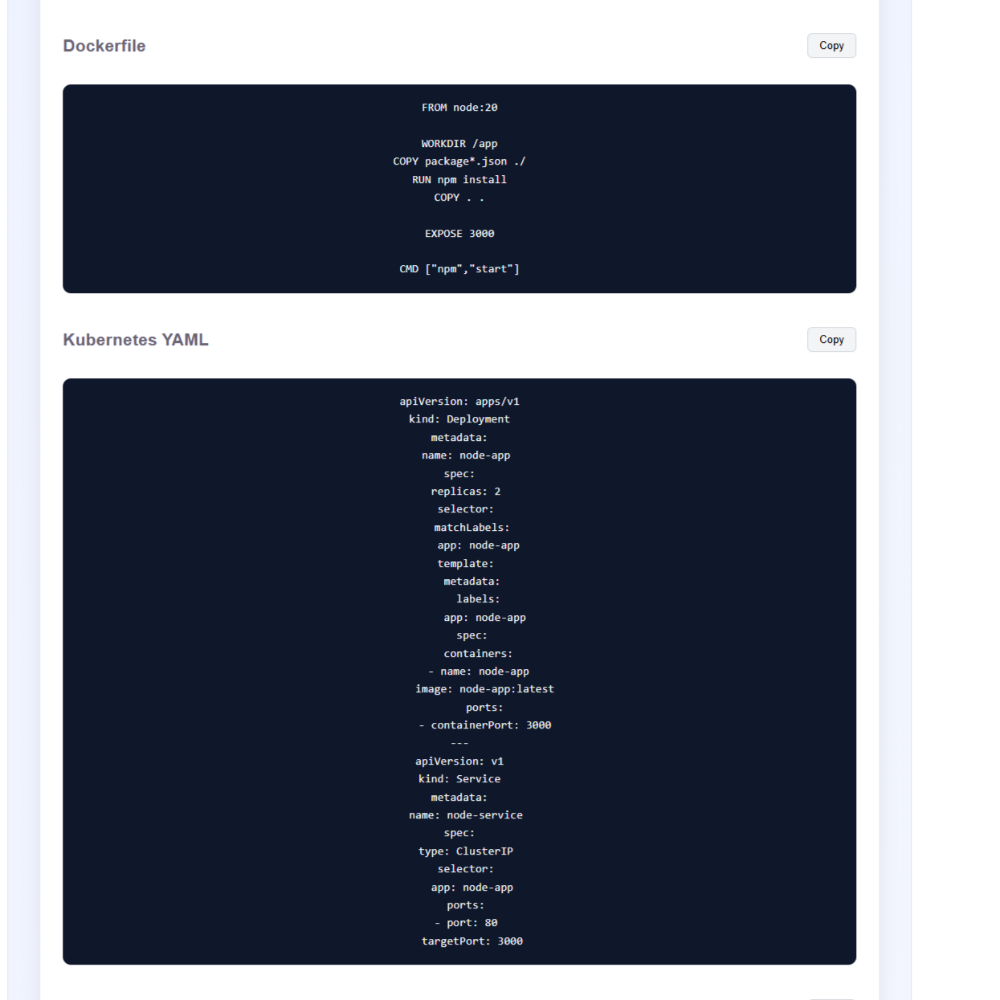
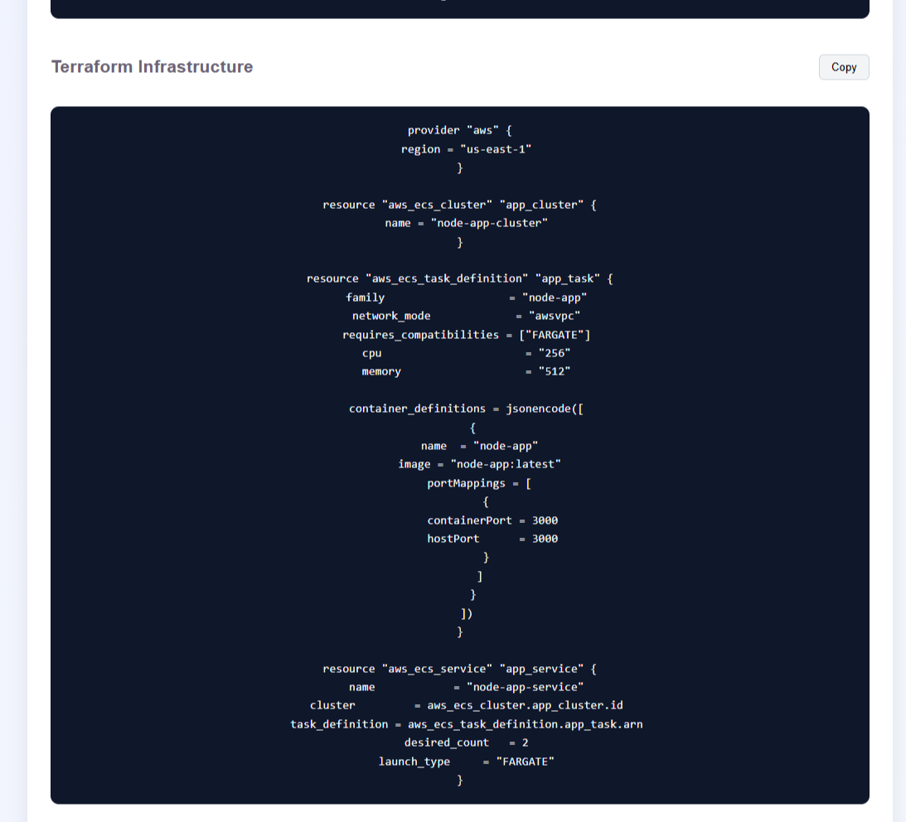

# AI DevOps Deployment Assistant

An intelligent DevOps automation platform that analyzes GitHub repositories and automatically generates deployment infrastructure.

The system detects the application stack and produces ready-to-use DevOps artifacts including **Dockerfiles, Kubernetes manifests, Terraform infrastructure, CI/CD pipelines, deployment scripts, and AI-powered deployment recommendations**.

---

# Live Application

Frontend (Vercel)

```
https://ai-devops-deployment-assistant.vercel.app
```

Backend API (Render)

```
https://ai-devops-deployment-assistant.onrender.com
```

GitHub Repository

```
https://github.com/RightXpertSolutions/ai-devops-deployment-assistant
```

---

# Features

## Repository Analysis

Analyze any public GitHub repository by providing the repository URL.

The system scans the repository structure and detects technologies used in the project.

Examples of detected stacks include:

* Node.js
* Express
* React
* Python
* Flask
* Django
* Next.js
* TypeScript
* Docker
* CI/CD configurations

---

## DevOps Artifact Generation

For each analyzed repository the system automatically generates deployment infrastructure.

### Dockerfile

Containerization configuration for the application.

### Kubernetes YAML

Deployment and service configuration for Kubernetes clusters.

### Terraform Infrastructure

Infrastructure as Code templates for AWS deployment.

### CI/CD Workflow

GitHub Actions pipeline for automated builds and deployment.

### Deployment Instructions

Step-by-step commands for deploying the application.

---

## AI DevOps Recommendations

The platform integrates AI to provide professional DevOps guidance including:

* Best deployment strategy
* Security considerations
* Scaling recommendations
* Infrastructure optimization suggestions
* Cost-efficient cloud architecture recommendations

---

## DevOps Package Download

Users can download a **complete DevOps deployment package** containing:

```
Dockerfile
deployment.yaml
main.tf
deploy.sh
.github/workflows/ci.yml
```

This allows developers to immediately deploy their applications.

---

## Analysis History

All repository analyses are stored in **MongoDB Atlas** and displayed in a dashboard for quick access.

---

# Architecture

## Frontend

React (Vite)

## Backend

Node.js
Express

## Database

MongoDB Atlas

## External APIs

GitHub API
OpenAI API

## Deployment Platforms

Vercel (Frontend)
Render (Backend)

---

# System Architecture

```
User
  ↓
React Frontend (Vercel)
  ↓
Node.js Express API (Render)
  ↓
Services Layer
   ├── GitHub API
   ├── OpenAI API
   └── DevOps Generator
  ↓
MongoDB Atlas
```

---

# Project Structure

```
ai-devops-deployment-assistant

client
  src
    components
    pages
    App.jsx
    main.jsx

server
  src
    routes
      analyzeRoute.js
    services
      githubService.js
      aiService.js
      devopsGenerator.js
    models
      Analysis.js
    controllers
      analyzeController.js
    index.js
```

---

# Installation

Clone the repository.

```
git clone https://github.com/RightXpertSolutions/ai-devops-deployment-assistant.git
```

Install backend dependencies.

```
cd server
npm install
```

Install frontend dependencies.

```
cd ../client
npm install
```

---

# Environment Variables

Create a `.env` file inside the **server folder**.

```
MONGO_URI=your_mongodb_connection_string
OPENAI_API_KEY=your_openai_api_key
GITHUB_TOKEN=your_github_personal_access_token
PORT=5000
```

Never commit the `.env` file to GitHub.

---

# Run the Application Locally

Start the backend server.

```
cd server
npm run dev
```

Start the frontend.

```
cd client
npm run dev
```

Open the application.

```
http://localhost:5173
```

---

# API Endpoint

Analyze GitHub Repository

```
POST /api/analyze
```

Request body example:

```json
{
  "repoUrl": "https://github.com/facebook/react"
}
```

Response:

```json
{
  "stack": "React + Node.js",
  "dockerfile": "...",
  "kubernetes": "...",
  "terraform": "...",
  "recommendations": "..."
}
```

---

# Deployment

## Frontend Deployment

Deployed using **Vercel**

```
vercel --prod
```

---

## Backend Deployment

Deployed using **Render**

Steps:

1. Connect GitHub repository
2. Set environment variables
3. Deploy Node.js service

---

# Security Best Practices

* API keys stored in environment variables
* `.env` excluded using `.gitignore`
* Backend handles all external API requests
* Frontend never exposes sensitive keys

---

# Example Workflow

1. Enter a GitHub repository URL
2. Click **Analyze**
3. System detects the technology stack
4. DevOps infrastructure is generated
5. AI provides deployment recommendations
6. Download the DevOps deployment package

---

# Screenshots



 
 
 
 
 


Example:

```
docs/images/dashboard.png
docs/images/analysis.png
docs/images/devops-output.png
```

---

# Future Improvements

* Multi-language stack detection
* Microservices architecture detection
* Multi-cloud deployment generation
* User authentication and accounts
* Deployment automation to cloud providers
* Infrastructure cost estimation

---

# Contribution

Contributions are welcome.

Steps:

1. Fork the repository
2. Create a feature branch
3. Commit changes
4. Open a Pull Request

---

# Author

Frederick Dordaah Ngmensoro Kuuyine
Full-Stack & DevOps Engineer in training.

Toronto, Canada

---

# License

MIT License

---


